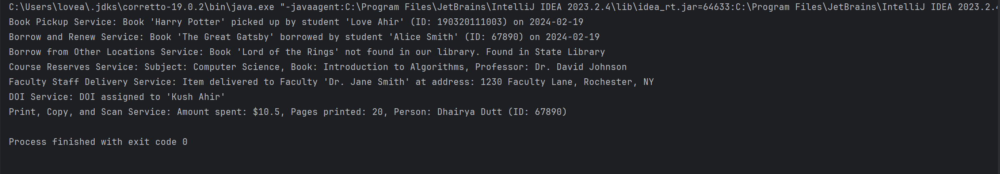

# LibraryServiceTrackerRIT
This application demonstrates the usage of the Visitor pattern to model various library services offered at the Rochester Institute of Technology (RIT). It allows users to interact with different library services and displays relevant information about each service.

## Purpose

The purpose of this project is to showcase the implementation of the Visitor design pattern in the context of RIT's library services. By using the Visitor pattern, we can separate the algorithms for different library service actions from the objects on which they operate, making it easy to add new services or modify existing ones without changing the code of the services themselves.

## Features

- Demonstrates the Visitor pattern implementation.
- Models various library services offered at RIT.
- Provides detailed information about each library service.
- Easy to extend with new library services.

## How to Run

To run the RIT Library Services App, follow these steps:

1. Clone the repository to your local machine.
2. Compile the Java files using a Java compiler.
3. Run the `LibraryApp` class, which contains the main method.

```bash
javac *.java
java LibraryApp


## Usage

Upon running the application, you will see the information about different library services displayed in the console. Each service will be visited by the `LibraryServiceDisplayVisitor`, which will print relevant details about the service.


